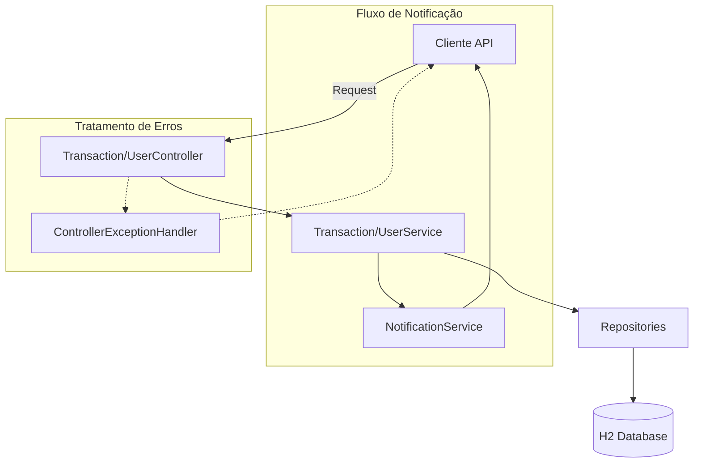

# PicPay Simplificado

Implementação de um sistema de transferências financeiras simplificado, desenvolvido como desafio técnico para a vaga de Back-End do PicPay, focando em atomicidade, consistência de dados e boas práticas de API REST.

---

## 📖 Sobre o Projeto

O PicPay Simplificado é uma representação minimalista do fluxo de pagamentos da plataforma PicPay. O objetivo central do projeto é implementar a lógica de transferência de valores entre contas de usuários, garantindo que a operação seja segura, validada e que ambas as partes sejam notificadas sobre a transação.

O projeto foca na resolução de problemas críticos de sistemas financeiros, como a validação de saldo suficiente para a transferência e a integridade dos dados durante a atualização de múltiplos registros simultaneamente.

O público-alvo são avaliadores técnicos e desenvolvedores interessados em padrões de implementação de sistemas de pagamento.

---

## ✨ Funcionalidades

- **Transferência de Valores**: Lógica de movimentação de saldo entre contas de usuários com validação de existência de conta.
- **Validação de Saldo**: Verificação rigorosa para impedir transferências que excedam o saldo disponível do remetente.
- **Sistema de Notificações**: Serviço automatizado para notificar o destinatário sobre o recebimento de novos valores.
- **Gestão de Usuários**: Controle de perfis de usuários com diferenciação de tipos (`UserType`).
- **Histórico de Transações**: Registro de todas as movimentações financeiras para fins de auditoria e consulta.
- **Tratamento de Erros Padronizado**: Implementação de um `ControllerExceptionHandler` para retornar respostas de erro consistentes e sem vazamento de stack-traces.

---

## 🏗 Arquitetura

A aplicação segue a **Arquitetura em Camadas**, isolando a lógica de transporte (API), a lógica de negócio (Services) e a persistência de dados (Repositories).



---

## 📂 Estrutura do Projeto

```text
.
├── src
│   └── main
│       └── java
│           └── com.picpaysimlificado
│               ├── controllers     # Endpoints REST para transferências e usuários
│               ├── domain          # Entidades de negócio (User, Transaction)
│               ├── dtos            # Objetos de transferência de dados (UserDTO, TransactionDTO)
│               ├── infra            # Configurações globais e tratamento de exceções
│               ├── repositories    # Interfaces de acesso ao banco de dados JPA
│               └── services        # Lógica de negócio e serviços de notificação
└── pom.xml                        # Dependências e build do Maven
```

---

## 🛠 Tecnologias Utilizadas

| Tecnologia | Finalidade |
|------------|------------|
| Java 24 | Linguagem de programação (versão de vanguarda) |
| Spring Boot 3.4 | Framework para desenvolvimento rápido de APIs REST |
| Spring Data JPA | Abstração para manipulação do banco de dados |
| H2 Database | Banco de dados em memória para testes e execução rápida |
| Maven | Gerenciador de dependências e build do projeto |
| Lombok | Redução de código boilerplate (Getters, Setters, etc.) |

---

## 📦 Dependências Principais

- **spring-boot-starter-web**: Provê a infraestrutura para a criação de endpoints REST.
- **spring-boot-starter-data-jpa**: Facilita a interação com o banco de dados através de repositórios.
- **h2**: Banco de dados leve que permite rodar a aplicação sem configurações externas de banco.
- **lombok**: Melhora a produtividade ao automatizar a criação de métodos comuns em entidades.

---

## ⚙ Fluxo da Aplicação

Solicitação de Transferência $\rightarrow$ Validação de Usuários $\rightarrow$ Verificação de Saldo $\rightarrow$ Débito do Remetente $\rightarrow$ Crédito do Destinatário $\rightarrow$ Registro da Transação $\rightarrow$ Disparo de Notificação $\rightarrow$ Retorno de Sucesso.

---

## 🚀 Como Executar

### Pré-requisitos

- JDK 24 ou superior
- Maven 3.x

---

### Clonando o projeto

```bash
git clone <url-do-repositorio>
cd Projetos-Diversos/PicPay-Simplificado
```

---

### Compilando e Executando

```bash
./mvnw spring-boot:run
```

---

## 🔍 Decisões Arquiteturais

- **Uso de H2 Database**: A escolha do banco de dados em memória foi tomada para tornar o projeto "plug-and-play", permitindo que qualquer avaliador execute a aplicação instantaneamente sem configurar um servidor MySQL/PostgreSQL.
- **Isolamento de Notificações**: A criação de um `NotificationService` separado da lógica de transação segue o princípio da responsabilidade única (SRP), facilitando a substituição do método de notificação (ex: de log para e-mail) no futuro.
- **Padronização de Respostas via DTOs**: O uso de `ExceptionDTO` e `TransactionDTO` garante que a API não exponha as entidades internas do banco de dados, protegendo a estrutura do sistema.

---

## 💡 Boas Práticas Utilizadas

- **Tratamento de Exceções Global**: Implementação de um interceptor de erros para garantir que a API nunca retorne páginas de erro HTML do servidor, mas sim JSONs padronizados.
- **Atomicidade de Operações**: Garantia de que a transferência de dinheiro ocorra como uma unidade de trabalho, evitando que o dinheiro "desapareça" em caso de falhas parciais.
- **Siga-se o Padrão REST**: Utilização correta dos verbos HTTP e códigos de status para cada operação.

---

## 📚 Aprendizados

Ao analisar este projeto, é possível aprender sobre:
- A implementação de lógicas financeiras críticas com Spring Boot.
- O gerenciamento de transações atômicas em bancos de dados relacionais.
- A criação de sistemas de notificação desacoplados.
- A implementação de tratamento de erros global em APIs REST.

---

## 👨‍💻 Autor

[Guilherme](https://github.com/guilherme-dev)
