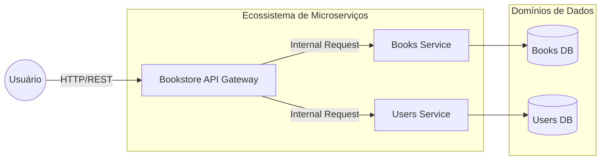

# Bookstore (Microservices)

Sistema de livraria implementado sob a arquitetura de microserviços, demonstrando a separação de responsabilidades e a escalabilidade de serviços independentes.

---

## 📖 Sobre o Projeto

O Bookstore é um projeto experimental de engenharia de software focado na implementação de microserviços utilizando o framework NestJS. O objetivo principal é demonstrar como decompor um sistema monolítico de e-commerce em serviços menores e independentes, onde cada serviço é responsável por um domínio específico do negócio.

A arquitetura implementa o padrão **API Gateway**, onde todas as requisições do cliente são recebidas por um único ponto de entrada que as distribui para os serviços internos, ocultando a complexidade da rede interna e simplificando a interface para o frontend.

O público-alvo são desenvolvedores interessados em arquiteturas distribuídas, microserviços e orquestração de APIs.

---

## ✨ Funcionalidades

- **API Gateway Centralizado**: Ponto único de entrada que roteia as requisições para os serviços de livros e usuários.
- **Serviço de Livros (Books Service)**: Gestão completa do catálogo de livros, incluindo operações de busca, listagem e detalhes.
- **Serviço de Usuários (Users Service)**: Controle de perfis, autenticação e gestão de dados dos clientes.
- **Comunicação Inter-serviços**: Implementação de troca de mensagens eficiente entre o Gateway e os microserviços.
- **Isolamento de Domínios**: Cada serviço possui sua própria lógica e dependências, permitindo atualizações independentes sem afetar o sistema global.
- **Escalabilidade Horizontal**: Estrutura preparada para que cada serviço possa ser escalado individualmente conforme a demanda.

---

## 🏗 Arquitetura

A aplicação utiliza o padrão de **Microserviços com API Gateway**, utilizando o módulo de microserviços do NestJS para a comunicação interna.



---

## 📂 Estrutura do Projeto

```text
.
├── apps
│   ├── bookstore-api-gateway  # Gateway de entrada e roteamento de requisições
│   ├── books                  # Microserviço de gestão de livros
│   └── users                  # Microserviço de gestão de usuários
├── node_modules               # Dependências do projeto
├── package.json               # Configurações globais e scripts de build
├── tsconfig.json              # Configurações de compilação do TypeScript
└── nest-cli.json              # Configurações do CLI do NestJS
```

---

## 🛠 Tecnologias Utilizadas

| Tecnologia | Finalidade |
|------------|------------|
| NestJS | Framework para construção de aplicações Node.js eficientes |
| @nestjs/microservices | Módulo para implementação de comunicação entre serviços |
| TypeScript | Tipagem estática para garantir a consistência dos contratos de API |
| RxJS | Programação reativa para manipulação de fluxos de dados assíncronos |
| Vite/Nest CLI | Ferramentas de build e automação de desenvolvimento |

---

## 📦 Dependências Principais

- **@nestjs/core**: Núcleo do framework para injeção de dependências e modularização.
- **@nestjs/microservices**: Provê as abstrações necessárias para a comunicação entre o Gateway e os serviços.
- **reflect-metadata**: Habilita as decorators do NestJS para configuração de classes e métodos.

---

## ⚙ Fluxo da Aplicação

Usuário $\rightarrow$ Requisição HTTP $\rightarrow$ API Gateway $\rightarrow$ Validação de Rota $\rightarrow$ Encaminhamento para Microserviço $\rightarrow$ Processamento da Regra de Negócio $\rightarrow$ Retorno ao Gateway $\rightarrow$ Resposta ao Usuário.

---

## 🚀 Como Executar

### Pré-requisitos

- Node.js instalado
- npm ou yarn

---

### Clonando o projeto

```bash
git clone <url-do-repositorio>
cd Projetos-Diversos/bookstore
```

---

### Instalando dependências

```bash
npm install
```

---

### Executando os Serviços

Como se trata de microserviços, é necessário iniciar cada aplicação:

```bash
# Iniciar o Gateway
npm run start # (ajustar conforme o script de build/start do nest)

# Iniciar o serviço de Livros
# (Utilizar o comando de start específico para a app /apps/books)

# Iniciar o serviço de Usuários
# (Utilizar o comando de start específico para a app /apps/users)
```

---

## 🔍 Decisões Arquiteturais

- **Utilização de API Gateway**: A decisão de implementar um Gateway evita que o frontend precise conhecer a URL de cada microserviço, simplificando a manutenção e permitindo a implementação de autenticação centralizada.
- **Monorepo com NestJS**: A escolha de manter todos os microserviços em um único repositório (`apps/`) facilita o compartilhamento de tipos e a consistência de versões entre os serviços.
- **Sincronia de Contratos**: O uso de TypeScript em todos os serviços garante que as mensagens trocadas entre o Gateway e os Microserviços sigam contratos rígidos, evitando erros de runtime.

---

## 💡 Boas Práticas Utilizadas

- **Separação de Domínios**: Cada microserviço lida exclusivamente com sua própria entidade, evitando a criação de um "monólito distribuído".
- **Sincronização de DTOs**: Uso de Data Transfer Objects para definir a estrutura de dados trafegadas entre os serviços.
- **Roteamento Declarativo**: Uso de decorators do NestJS para definir endpoints de forma clara e organizada.

---

## 📚 Aprendizados

Ao analisar este projeto, é possível aprender sobre:
- A implementação de padrões de arquitetura de microserviços.
- O papel e a importância de um API Gateway em sistemas distribuídos.
- A comunicação assíncrona e síncrona entre serviços utilizando NestJS.
- A gestão de dependências em projetos monorepo.

---

## 👨‍💻 Autor

[Guilherme](https://github.com/guilherme-dev)
