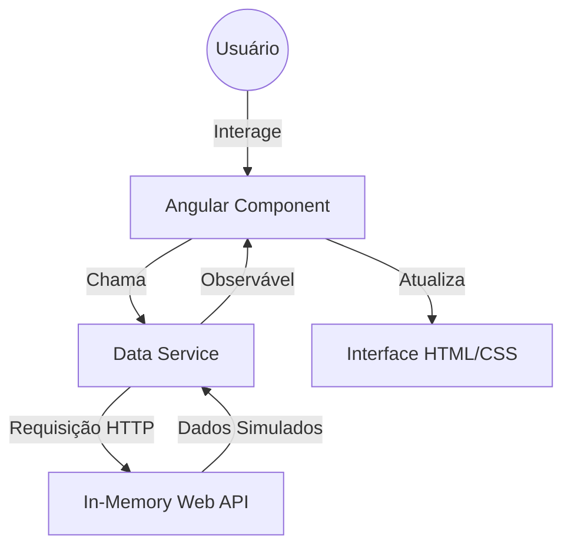

# First App (Angular Example)

Projeto de estudo desenvolvido com Angular para a exploração de conceitos fundamentais do framework, implementando as diretrizes dos guias oficiais da angular.io.

---

## 📖 Sobre o Projeto

O First App é um projeto didático destinado ao aprendizado de Angular. Ele serve como a primeira implementação prática de conceitos essenciais como roteamento, injeção de dependência e comunicação entre componentes.

O diferencial técnico deste projeto é a utilização da `angular-in-memory-web-api`, que permite simular o comportamento de um servidor REST completo dentro do próprio navegador. Isso possibilita o desenvolvimento e teste de funcionalidades de CRUD sem a dependência de um backend real, acelerando o ciclo de feedback durante o aprendizado.

O público-alvo são desenvolvedores iniciantes em Angular e estudantes de front-end.

---

## ✨ Funcionalidades

- **Simulação de API REST**: Implementação de um backend em memória para persistência temporária de dados durante a sessão.
- **Navegação Dinâmica**: Sistema de rotas configurado para transitar entre diferentes visualizações da aplicação.
- **Gestão de Dados**: Operações básicas de leitura e escrita de dados utilizando serviços Angular.
- **Interatividade de Formulários**: Captura e validação de entradas do usuário utilizando os módulos de formulários do Angular.
- **Renderização Reativa**: Atualização automática da interface baseada em mudanças no estado dos dados via RxJS.

---

## 🏗 Arquitetura

A aplicação segue a arquitetura padrão do **Angular**, baseada em módulos e componentes, com uma clara separação entre a lógica de apresentação e a de dados.



---

## 📂 Estrutura do Projeto

```text
.
├── src
│   ├── app                # Lógica principal da aplicação (Componentes, Serviços, Módulos)
│   ├── assets             # Recursos estáticos (Imagens, Ícones)
│   └── index.html         # Página principal de entrada
├── e2e                    # Testes de ponta a ponta (End-to-End)
├── angular.json           # Configurações do Angular CLI
├── package.json           # Dependências e scripts de execução
└── tsconfig.json          # Configurações do compilador TypeScript
```

---

## 🛠 Tecnologias Utilizadas

| Tecnologia | Finalidade |
|------------|------------|
| Angular 17 | Framework para construção de aplicações web robustas |
| TypeScript | Linguagem com tipagem estática para maior segurança do código |
| RxJS | Biblioteca para programação reativa e fluxos de dados |
| angular-in-memory-web-api | Simulação de API REST para desenvolvimento local |
| Angular CLI | Ferramenta de linha de comando para automação de build |

---

## 📦 Dependências Principais

- **@angular/core**: Núcleo do framework, provendo a reatividade e a gestão de componentes.
- **@angular/router**: Responsável pelo gerenciamento de rotas da aplicação.
- **angular-in-memory-web-api**: Permite a interceptação de requisições HTTP para retornar dados simulados.
- **rxjs**: Utilizado para gerenciar a assincronia dos dados vindos da API simulada.

---

## ⚙ Fluxo da Aplicação

Acessar App $\rightarrow$ Solicitar Dados ao Serviço $\rightarrow$ Interceptação pela In-Memory API $\rightarrow$ Retorno de Dados $\rightarrow$ Atualização do Componente $\rightarrow$ Renderização na Tela.

---

## 🚀 Como Executar

### Pré-requisitos

- Node.js instalado
- Angular CLI (`npm install -g @angular/cli`)

---

### Clonando o projeto

```bash
git clone <url-do-repositorio>
cd Projetos-Diversos/first-app
```

---

### Instalando dependências

```bash
npm install
```

---

### Executando a aplicação

```bash
npm start
```
A aplicação estará disponível em `http://localhost:4200`.

---

## 🔍 Decisões Arquiteturais

- **Uso de In-Memory Web API**: Foi escolhida para evitar a complexidade de configurar um banco de dados real em um projeto de aprendizado, focando exclusivamente na lógica do front-end.
- **Implementação de Services**: Toda a lógica de busca de dados foi isolada em serviços, seguindo a boa prática de não colocar lógica de negócio dentro dos componentes.
- **Uso de RxJS**: A implementação de Observables para a recepção de dados garante que a interface permaneça responsiva enquanto os dados são processados.

---

## 💡 Boas Práticas Utilizadas

- **Modularização**: Divisão da aplicação em módulos lógicos, facilitando a organização do código.
- **Tipagem de Dados**: Uso de interfaces TypeScript para definir a estrutura dos dados simulados.
- **Padronização Angular**: Segue rigorosamente a estrutura de pastas e nomes sugerida pelo guia oficial do Angular.

---

## 📚 Aprendizados

Ao analisar este projeto, é possível aprender sobre:
- Os fundamentos do framework Angular (Componentes, Services, Modules).
- Como simular APIs REST para acelerar o desenvolvimento de front-ends.
- O uso de roteamento dinâmico em Single Page Applications (SPAs).
- A implementação de fluxos de dados reativos com RxJS.

---

## 👨‍💻 Autor

[Guilherme](https://github.com/guilherme-dev)
